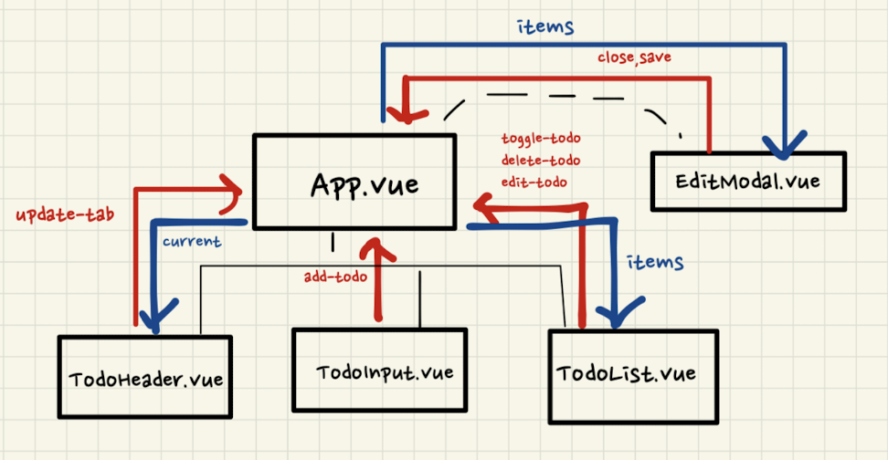
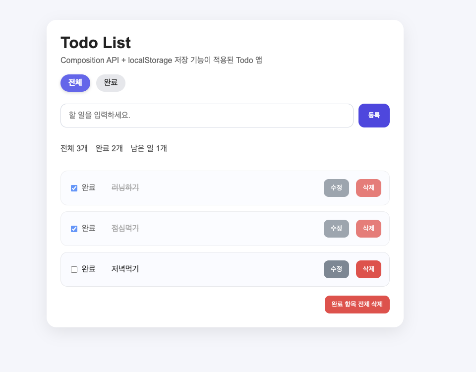
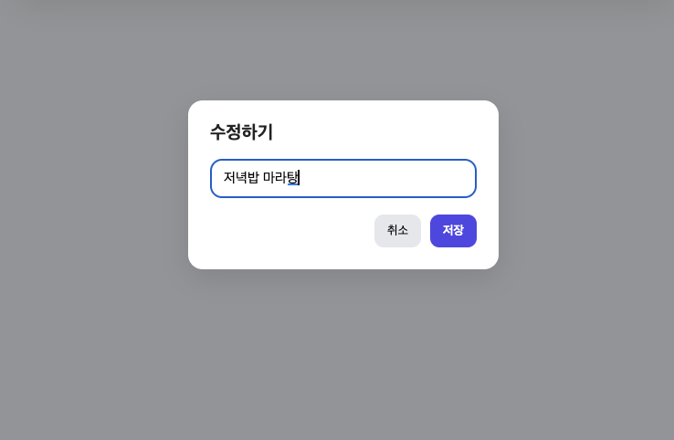

# vue-todolist

[Vue.js]를 학습하고 TodoList 코드 작성하고,
Options API → Composition API → <script setup> 방식으로 리팩토링한 프로젝트입니다.

1.options API

- vue2문법을 활용해서 기본 기능을 구현해보기
- data,methods 등의 옵션을 활용

2.Composition API - setup()

- setup()을 익혀서 옵션기반에서 함수로 각각 분리하기
- ref, reactive오 반응형 데이터

3.Composition API - <script setup>

- script setup문법을 활용해서 간결한 코드 만들기
- props,emit 를 직관적으로 구성

### 컴포넌트 구조

### 핵심기능

1. todolist 입력
2. todolist 시각화
3. todolist 삭제
4. tab기능 - 전체 / 완료

### 추가기능: 03_Composition_API

(추가) 수정하기 모달추가 (teleport활용)
(추가) local DB storage 구현

### 화면 미리보기

  
  

